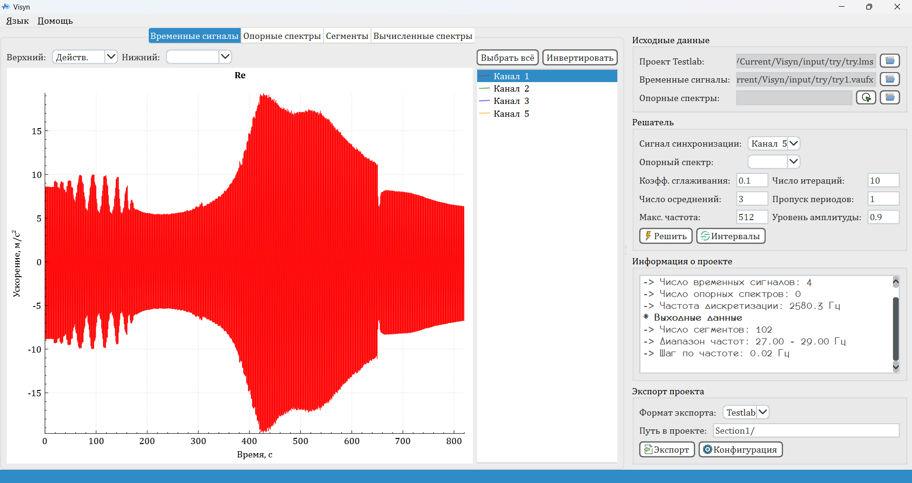
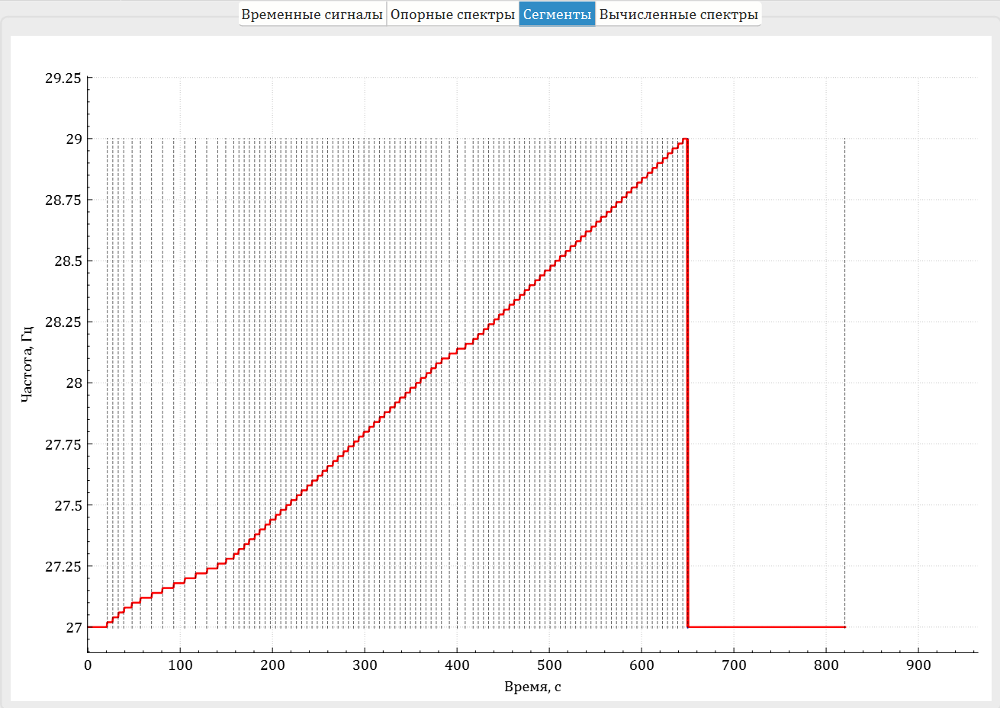
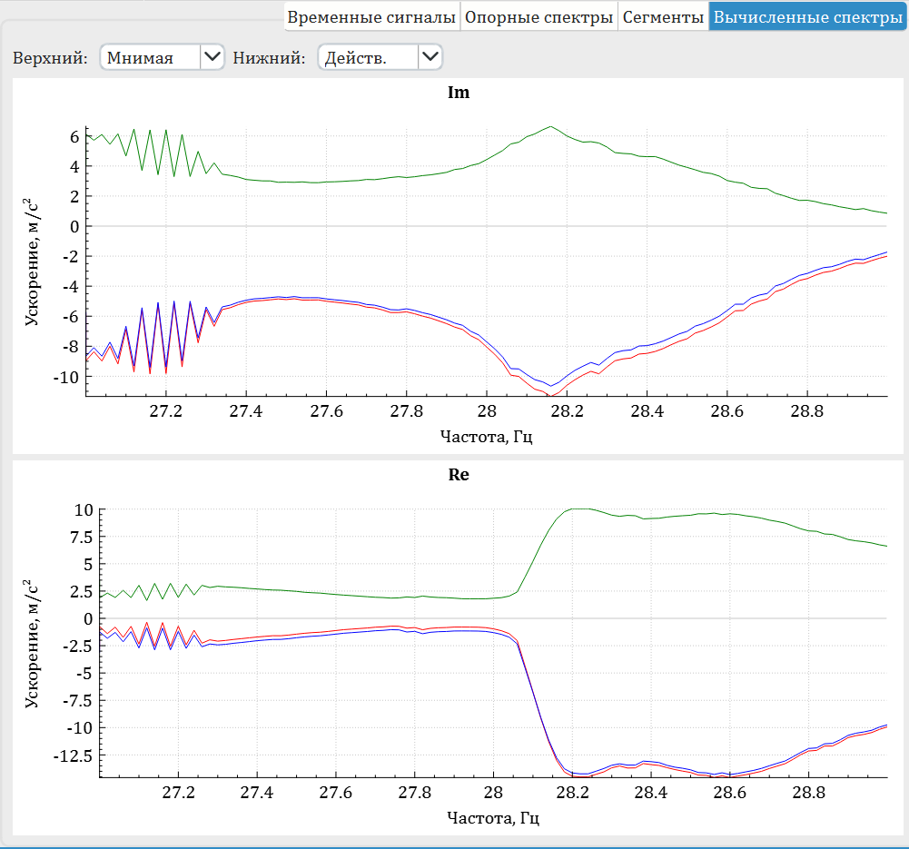

## О программе

Программа `Visyn` предназначена для вычисления гармонических откликов по временным сигналам с акселерометров, размещенных на конструкции. Для получения временных откликов к конструкции прикладывается воздействие в режиме `SineStep`. При этом данные о частотах и интервалах возбуждения либо отсутствуют, либо являются неполными, что так или иначе обуславливает невозможность их использования. 

## Алгоритм

Для вычисления спектров используется следующий алгоритм:
* Осуществляется первичная оценка интервалов изменения частоты процесса  методом отыскания корней канала синхронизации, который изменяется синхронно с частотой возбуждения и имеет постоянную амплитуду.
* С целью исключения осцилляций первичных данных осуществляется фильтрация и интерполяция выбросов по медианным абсолютным отклонениям (`MAD`).
* Далее выделяются кусочно-постоянные фрагменты по частотам как решение задачи минимизации полной дисперсии (`Total Variance Denoising`).

* Для нахождения границ участков используется алгоритм детекции границ (`Canny Edge Detector`).
* На каждом из интервалов считается свертка с гармоническим сигналом канала синхронизации, с последующей оценкой действительной и мнимой составляющих спектра. Полученные данные агрегируются по всем участкам.

Вычисленные спектры загружаются в проект с записями посредством интерфейса `LMS Testlab Automation`. Таким образом, в случае, когда в системе недостает каналов измерения, может быть задействована измерительная система от другого производителя с последующей синхронизацией данных посредством разработанной программы `Visyn`. 

